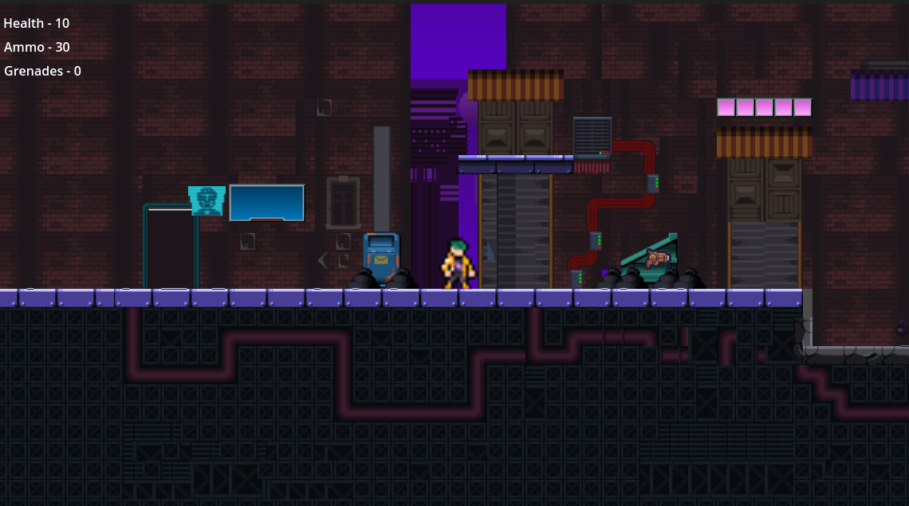
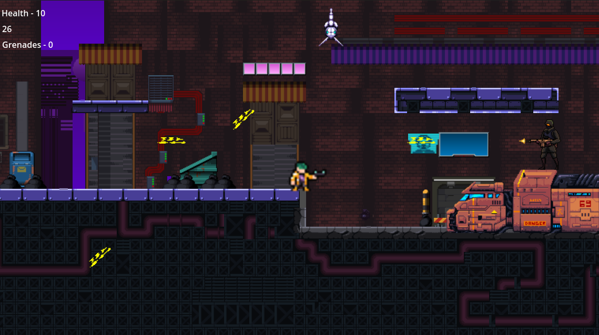
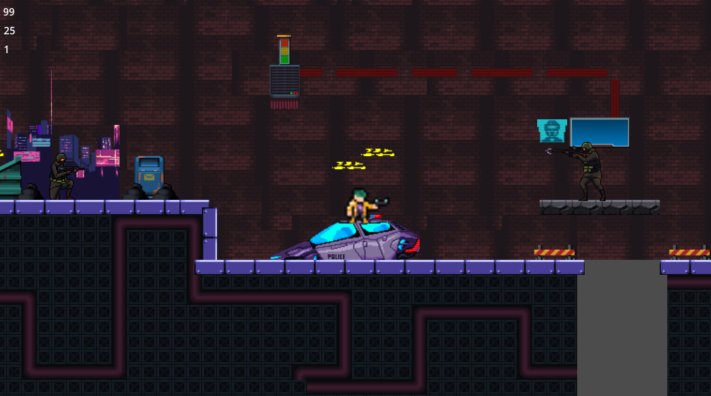
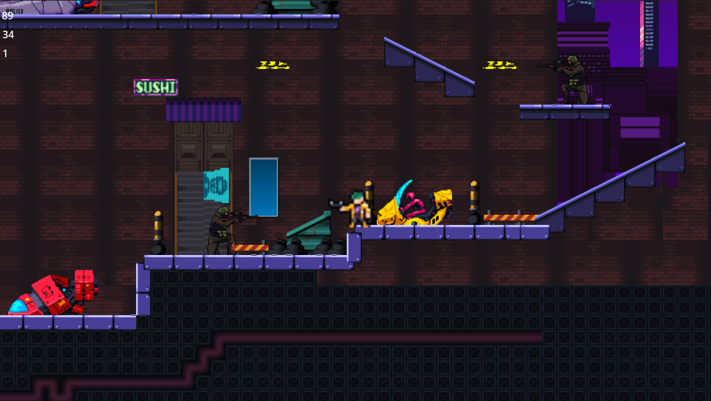

# Cyberpunk Platformer

A fast-paced, neon-drenched cyberpunk platformer built in **Godot**, featuring pulse-pounding synthwave music, bot soilders and drones!

## 🎮 Screenshots






## 🛠 Built With

- **Godot Engine** – Open-source game development engine.
- **GDScript** – Primary scripting language for game logic.
- **Pixel Art & Shaders** – Stylish cyberpunk visuals.

## 🔧 Installation

1. Clone this repository:
   ```bash
   git clone https://github.com/yourusername/cyberpunk-platformer.git
